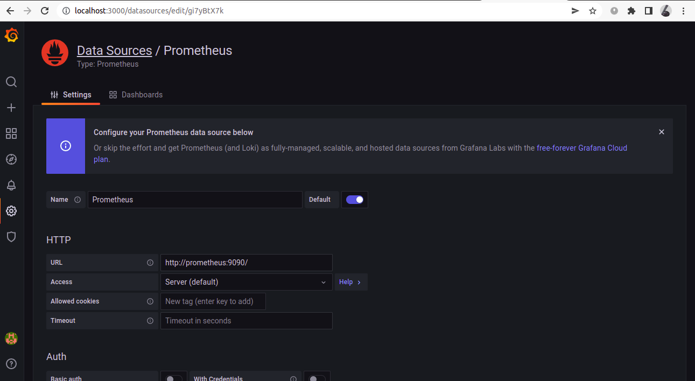
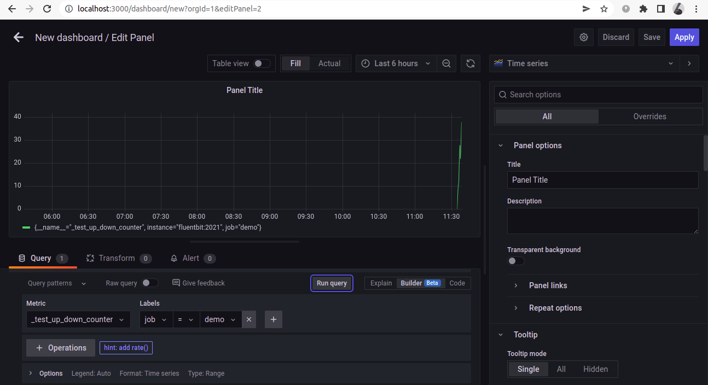
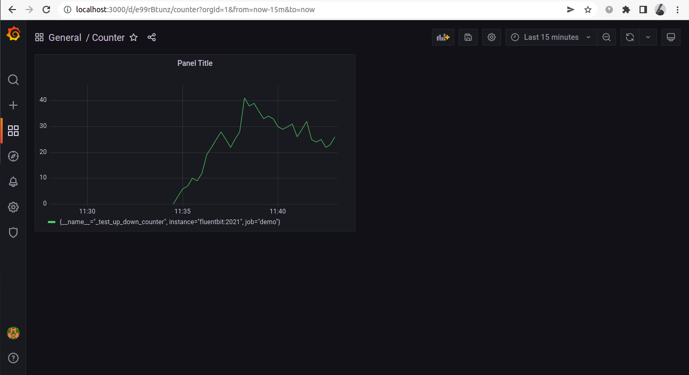

### FluentBit metrics demo

Demo for using FluentBit to export metrics. 
We instrument the application using OpenTelemetry and send the metrics to FluentBit using the OpenTelemetry input plugin, which are then exported using the [Prometheus exporter](https://docs.fluentbit.io/manual/pipeline/outputs/prometheus-exporter) output plugin. This can be now visualized in Grafana.

The demo shows you how to export metrics from your application to an external endpoint using FluentBit.

### Steps to set up:

1. Clone the repo and navigate to the directory
```
git clone https://github.com/Syn3rman/fluentbit-metrics-demo.git
cd fluentbit-metrics-demo
```

2. Run `docker-compose up -d --build` to start the application

3. Go to `localhost:3000` and login to Grafana using credentials admin, admin

4. in configuration>data sources select Prometheus and add the url as `http://prometheus:9090/`



5. Create dashboard and add panel to visualize data



The dashboard now should look something like this




### Directory structure

app/
	metrics.js: OpenTelemetry instrumented application that exports metrics to an endpoint (FluentBit here) using the otlp protocol

fluentbit/
	fluent.conf: FluentBit configuration file. We are using the OpenTelemetry input plugin to accept data using the otlp protocol, and the stdout and prometheus exporter output plugins to log the metrics to the console and expose them on an endpoint respectively. The prometheus export output plugin starts a server which can be scraped by Prometheus.

prometheus/
	prometheus.yml: Prometheus config file, we use it to scrape metrics from FluentBit	
